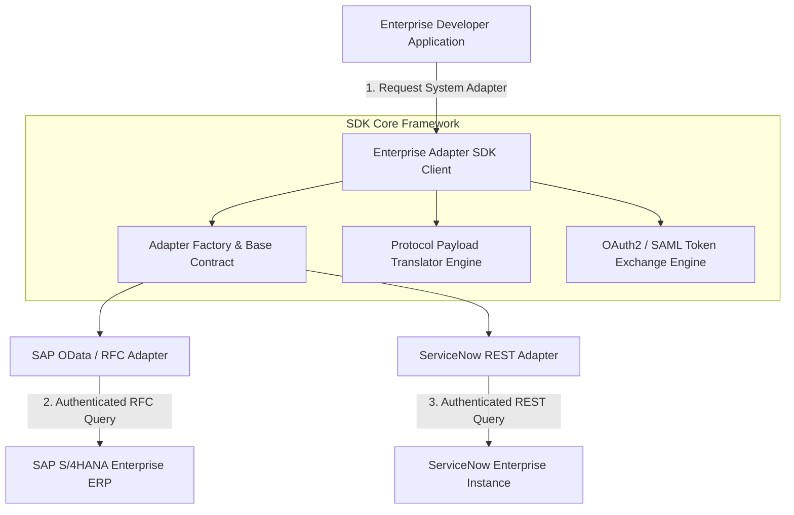

<div align="center">


# Enterprise Adapter SDK

### Multi-Protocol Enterprise System Integration Framework & Payload Translation SDK

**SAP RFC/OData • ServiceNow REST • Protocol Normalization • OAuth2 Token Exchange • Python SDK**

[](https://python.org)
[](https://devopstrio.co.uk)
[](https://devopstrio.co.uk)
[](https://devopstrio.co.uk)

</div>

---

## 🏛️ Strategic Executive Summary & Product Vision

The **Enterprise Adapter SDK** is a high-performance Python integration framework designed to streamline connectivity between modern cloud applications and legacy enterprise systems (such as **SAP S/4HANA**, **ServiceNow**, **Salesforce**, and **Oracle ERP**).

Connecting to heterogeneous enterprise backends typically requires managing proprietary authentication tokens, inconsistent data structures, and disparate network protocols (OData v2/v4, RFC, SOAP, REST). This SDK provides a **Unified Abstract Adapter Contract**, **Automated Protocol Payload Normalization**, and **Enterprise Token Exchange**, enabling developers to write single-interface code for complex enterprise integrations.


---

## 🔄 System Architecture & Sequence Flow



---

## 💎 Core Architectural Subsystems & Feature Breakdown

### 1. 🔌 Abstract Enterprise Adapter Contract (`core/base_adapter.py`)
* **Standardized Class Base**: Enforces `connect()`, `execute_query()`, and `send_command()` across all system adapters.
* **Extensible Architecture**: Allows easy addition of custom enterprise systems without modifying core client logic.

### 2. 🔀 Protocol Payload Translator Engine (`core/protocol_translator.py`)
* **Canonical JSON Normalization**: Converts non-standard structures (e.g. SAP OData `d` wrappers, ServiceNow `sys_id` records) into unified canonical JSON format.

### 3. 🔑 Enterprise Token Exchange (`core/token_exchange.py`)
* **Token Transformation**: Translates incoming client credentials into target system bearer tokens or SAML assertions securely.

### 4. 💻 Unified Developer SDK Client (`sdk/client.py`)
* **One-Line Execution**: High-level wrapper (`execute_and_translate`) that manages adapter instantiation, authentication handshakes, and response translation.

---

## 📊 Protocol Support & Translation Matrix

| Target System | Underlying Protocol | Authentication Mechanism | Raw Payload Format | Canonical Output Format |
| :--- | :---: | :---: | :---: | :---: |
| **SAP S/4HANA** | OData v2 / RFC | OAuth2 / Basic Auth | XML / Wrapped JSON (`d`) | Standardized Canonical JSON |
| **ServiceNow** | REST Table API | Basic Auth / OAuth2 | Nested JSON (`result`) | Standardized Canonical JSON |
| **Salesforce** | REST / SOAP API | OAuth2 Web Server Flow | Complex JSON | Standardized Canonical JSON |
| **Generic Enterprise** | REST / HTTP | Bearer Token / API Key | Raw JSON | Standardized Canonical JSON |

---

## 📂 Repository Directory & Component Structure

```
enterprise-adapter-sdk/
├── .github/
│   └── workflows/
│       └── test-and-publish.yml # Automated CI pipeline
├── docs/
│   ├── ARCHITECTURE.md          # Architectural specification
│   ├── deployment-guide.md      # Integration & deployment guide
│   └── images/
│       └── architecture_diagram.jpg # High-resolution architecture visual
├── core/
│   ├── __init__.py
│   ├── base_adapter.py          # Abstract protocol adapter contract
│   ├── protocol_translator.py   # JSON/XML payload translator engine
│   └── token_exchange.py        # Enterprise token exchange manager
├── adapters/
│   ├── __init__.py
│   ├── sap_adapter.py           # SAP OData/RFC enterprise adapter
│   └── servicenow_adapter.py    # ServiceNow enterprise adapter
├── sdk/
│   ├── __init__.py
│   └── client.py                # Unified developer SDK client
├── examples/
│   └── enterprise_integration_example.py # Runnable integration script
├── tests/
│   ├── __init__.py
│   ├── test_base_adapter.py     # Base adapter contract unit tests
│   ├── test_protocol_translator.py # Translator engine unit tests
│   ├── test_adapters.py         # System adapters unit tests
│   └── test_sdk_client.py       # SDK client integration tests
├── setup.py                     # Setuptools packaging file
├── pyproject.toml               # Modern build system configuration
├── requirements.txt             # Python dependencies
├── pytest.ini                   # Pytest configuration
└── README.md                    # Project documentation
```

---

## 📈 Enterprise Feature Comparison Matrix

| Capability | Ad-hoc Direct API Calls | Heavy Enterprise ESB (MuleSoft/Tibco) | Enterprise Adapter SDK |
| :--- | :---: | :---: | :---: |
| **Developer Ergonomics** | Low (Repetitive code) | Complex (Config heavy) | ✅ **High (Clean Python SDK)** |
| **Payload Normalization** | Manual per call | ESB Transformations | ✅ **Automated Canonical JSON Engine** |
| **Runtime Overhead** | Low | High Latency Overhead | ✅ **Sub-Millisecond In-Memory Execution** |
| **Testability** | Hard to mock | Requires ESB Mock Servers | ✅ **100% Pytest Ready with Native Mocks** |
| **Deployment Footprint** | None | Massive Server Fleet | ✅ **Zero-Dependency Lightweight Python Package** |

---

## 🚀 Quick Start & Integration Guide

### 1. Developer Setup

```bash
# Clone repository
git clone https://github.com/Devopstrio/enterprise-adapter-sdk.git
cd enterprise-adapter-sdk

# Install package in editable mode
pip install -e .
```

### 2. Execute Integration via Python SDK

```python
from sdk.client import EnterpriseAdapterSDK

# Initialize SDK Client
sdk = EnterpriseAdapterSDK()

# Query SAP OData and obtain normalized canonical payload
sap_response = sdk.execute_and_translate(
    system_name="sap",
    connection_params={"sap_host": "sap-prod.internal"},
    query_id="99482"
)

print("Canonical Output:", sap_response["canonical_payload"])
```

### 3. Query ServiceNow Instance

```python
sn_response = sdk.execute_and_translate(
    system_name="servicenow",
    connection_params={"instance_url": "https://devopstrio.service-now.com"},
    query_id="1001"
)

print("Incident Record:", sn_response["canonical_payload"])
```

### 4. Running Automated Test Suite

```bash
python -m pytest -v tests/
```

---

## 🛡️ Security & Token Governance

* **Encrypted Credentials**: Credentials and API keys are passed strictly via secure environment variables or vault integrations.
* **Token Isolation**: The Token Exchange engine issues transient access tokens with configurable TTL expiration.
* **Non-Root Execution**: Ready for containerized deployment in secure, unprivileged environments.

<div align="center">

<sub>&copy; 2026 Devopstrio &mdash; Engineering Uninterrupted Global Workforce Productivity.</sub>

</div>
