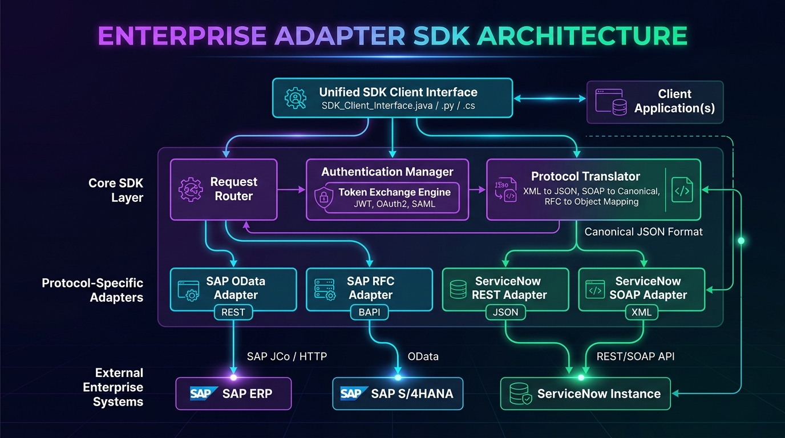
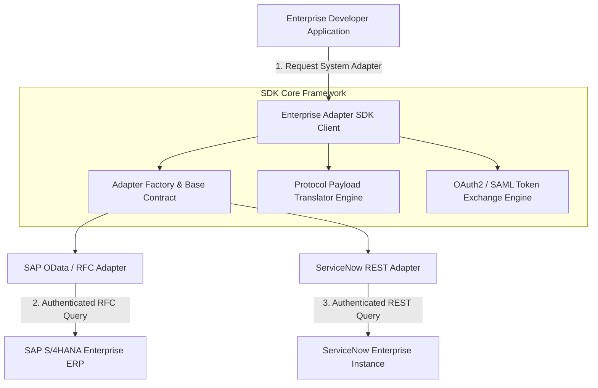

# Enterprise Adapter SDK Architecture

The **Enterprise Adapter SDK** provides a multi-protocol integration layer, protocol translation matrix (JSON, XML, SOAP $\rightarrow$ Canonical JSON), enterprise token exchange engine, and abstract adapter interfaces for legacy enterprise systems (SAP, ServiceNow, Salesforce, Oracle).

## Component Sequence Flow

## Core Modules

1. **Base Adapter Contract (`core/base_adapter.py`)**
   - Establishes abstract class requirements for connection handling, RPC query execution, and command writes (`connect`, `execute_query`, `send_command`).

2. **Protocol Translator Engine (`core/protocol_translator.py`)**
   - Normalizes SAP OData `ObjectID` structures and ServiceNow `sys_id` records into standardized canonical JSON objects.

3. **Enterprise Token Exchange (`core/token_exchange.py`)**
   - Handles token transformation and secure credential propagation across hybrid enterprise environments.
